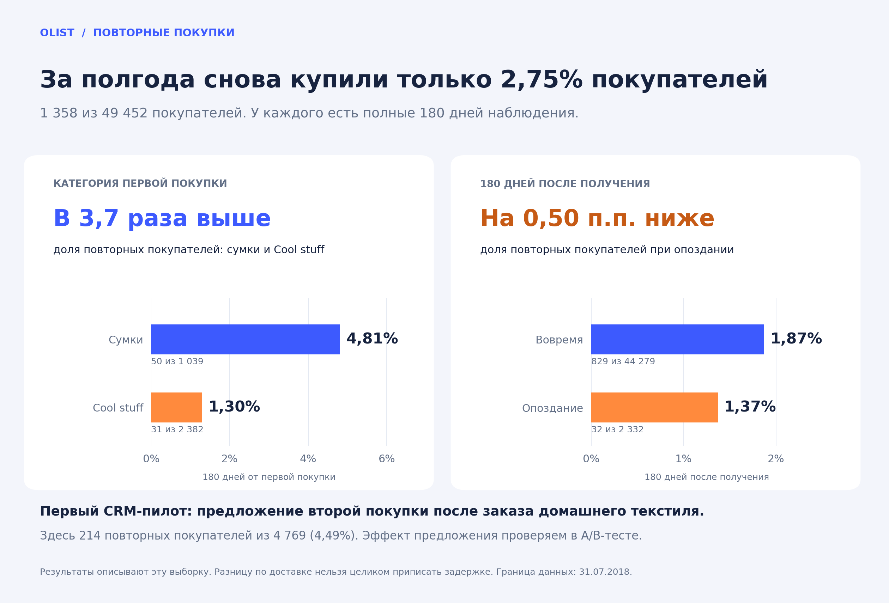

# Olist: кто покупает повторно

**За 180 дней снова купили 1 358 из 49 452 покупателей — 2,75%.** У каждого есть полный срок наблюдения.

Проект помогает выбрать сегмент для теста второй покупки и проверить, отличается ли доля повторных покупателей после первой доставки вовремя и с опозданием.

**Стек:** SQLite · Python · pandas · Matplotlib.



## Основные выводы

- **Сумки и домашний текстиль — первые по доле повторных покупателей среди 17 крупных категорий:** 4,81% (50 из 1 039) и 4,49% (214 из 4 769). Для первого CRM-пилота предлагаю домашний текстиль: при близкой доле повторов его база в 4,6 раза больше.
- **У сумок доля выше, чем у Cool stuff, в 11 из 13 месяцев.** Разница видна и при сравнении покупателей, начавших в одном месяце. Общие доли за всю выборку — 4,81% против 1,30%.
- **После опоздания повторно купили 1,37%, при доставке вовремя — 1,87%.** Здесь обеим группам дано 180 дней после получения. Разницу в 0,50 п.п. нельзя целиком приписать задержке: состав покупателей может различаться.
- **5,77% у сумок с опозданием — всего три покупателя из 52.** Двое оформили повтор до получения первой покупки. Оснований говорить о пользе задержек по этой группе нет.

## Что проверить бизнесу

| Тест | Основание | Критерий решения |
| --- | --- | --- |
| Предложение второй покупки после заказа домашнего текстиля | 214 повторных покупателей из 4 769; доля 4,49% | Сравнить повторы и маржу с контрольной группой, учесть скидку и затраты на коммуникацию. |
| Уведомления и помощь покупателям при задержке | После получения: 1,37% повторных при опоздании против 1,87% вовремя | Сравнить варианты поддержки среди покупателей с задержкой; измерить повторы и расходы. |

Перед тестами нужно рассчитать необходимое число участников. Анализ помогает выбрать проверки; размер их эффекта здесь не оценён.

## Подробности и расчёты

- [Выводы с четырьмя графиками, цифрами и ограничениями](reports/findings.md)
- [Порядок запуска и описание пяти SQL-файлов](docs/REPRODUCE.md)
- [Сохранённые агрегаты для графиков](reports/tables)
- [Правила оформления портфолио](docs/PORTFOLIO_STYLE.md)

## Структура проекта

| Папка | Что внутри |
| --- | --- |
| [sql](sql) | Пять файлов: таблицы, качество данных, повторные покупки, категории, доставка. |
| [analysis](analysis) | Сборка графиков и HTML-отчёта; текст и оформление отделены от расчётов. |
| [reports](reports) | Выводы, графики PNG/SVG и небольшие таблицы результатов. |
| [docs](docs) | Инструкция запуска и правила подачи. |
| [data](data) | Инструкция по исходным данным; CSV и локальная база исключены из Git. |

## Данные и ограничения

Источник — [Olist Brazilian E-Commerce](https://www.kaggle.com/datasets/olistbr/brazilian-ecommerce). Рабочая граница наблюдения: 31.07.2018 23:59:59. Покупатель — `customer_unique_id`; учитываются заказы со статусом `delivered`.

Основная метрика — повтор за 180 дней от первой наблюдаемой покупки. Для сравнения после получения используется отдельное полное окно. Категории выбраны после просмотра результатов; анализ описательный. Отсутствие повтора за полгода не означает уход навсегда.

## Быстрый запуск

Выполнить SQL по [инструкции](docs/REPRODUCE.md), сохранить итоговую выгрузку как `data/buyer_analysis.csv`, затем:

```bash
python -m pip install -r requirements.txt
python analysis/build_report.py --input data/buyer_analysis.csv --output reports
```

HTML-отчёт создаётся локально как `reports/olist_report.html`. В GitHub подробные выводы читаются в [Markdown-отчёте](reports/findings.md).
