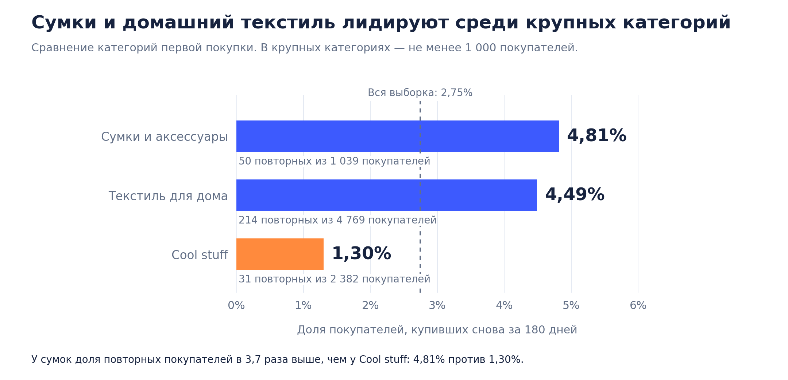
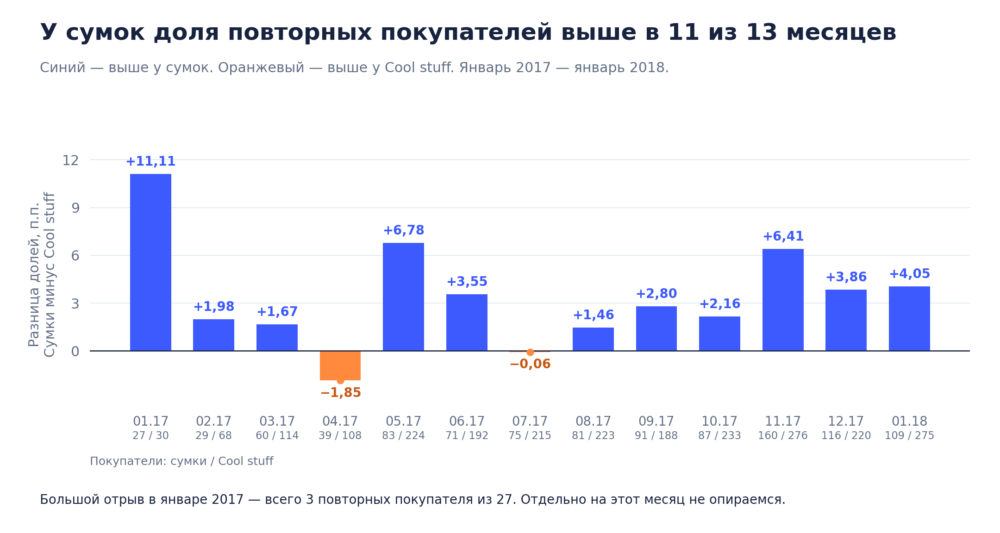
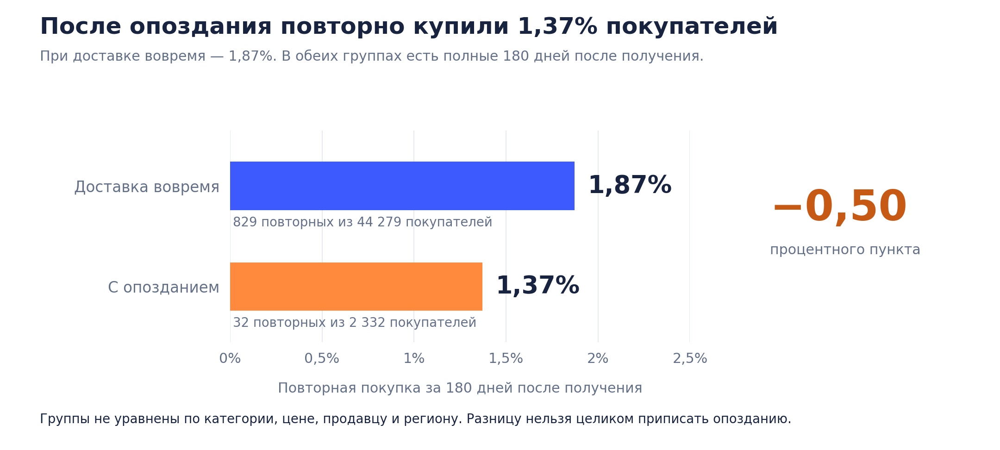
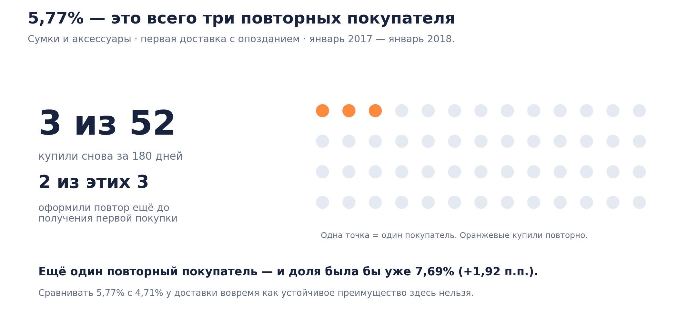

# Выводы: повторные покупки в Olist

## Что получилось

### 1. Сумки и домашний текстиль — кандидаты для CRM-пилота

В сумках снова купили **50 из 1 039 покупателей — 4,81%**. В домашнем текстиле — **214 из 4 769, или 4,49%**. Это первые два места среди 17 категорий с ≥ 1 000 покупателей. Для сравнения: в Cool stuff — 31 из 2 382, или 1,30%.

Для первого пилота предлагаю домашний текстиль: доля повторов близка к сумкам, а база покупателей в 4,6 раза больше. Проверка — одно предложение второй покупки после получения заказа; результат сравнить с контрольной группой по повторным покупкам и марже.

### 2. Преимущество сумок перед Cool stuff видно в 11 из 13 месяцев

В январе 2017 — январе 2018 доля повторных покупателей сумок была выше в **11 из 13 месячных групп**. Исключения — апрель и июль 2017. Разница видна и при сравнении покупателей, начавших в одном месяце.

Январские 11,11% у сумок — всего три повторных покупателя из 27. На отдельные месячные пики решение не опирается.

### 3. После опоздания доля повторных покупателей ниже на 0,50 п.п.

За **180 дней после получения** снова купили 829 из 44 279 покупателей с доставкой вовремя — **1,87%**. После опоздания — 32 из 2 332, или **1,37%**. Обеим группам дан одинаковый срок.

Считать от получения важно: 526 из 1 358 повторных покупателей оформили ближайший повтор ещё до полного получения первой покупки. Для отдельного расчёта после получения проверены все более поздние заказы.

Группы не уравнены по категории, цене, продавцу и региону. Разницу нельзя целиком приписать задержке. Следующий тест — уведомления и помощь покупателям с опозданием; измерить эффект коммуникации на повторы и затраты на поддержку.

### 4. Высокий процент в малой группе не даёт основания менять сроки доставки

Внутри сумок с опозданием доля выше: **5,77% против 4,71%** при доставке вовремя. Но 5,77% — только **три покупателя из 52**. Двое из этих троих оформили повтор до получения первой покупки.

Ещё один повторный покупатель изменил бы долю до 7,69% — сразу на 1,92 п.п. Для вывода о пользе задержек эта группа слишком мала.

## Следующие действия

| Действие | Основание | Как принять решение |
| --- | --- | --- |
| Тест предложения второй покупки в домашнем текстиле | 4 769 покупателей, 214 повторных, доля 4,49% | Случайное назначение предложения или обычного сценария. Сравнить повторы и маржу с учётом скидок и коммуникации; заранее рассчитать число участников. |
| Тест уведомлений и поддержки при задержке | После получения: 1,37% при опоздании против 1,87% вовремя | Случайное назначение вариантов среди покупателей с задержкой. Сравнить повторы и стоимость поддержки. |
| Оценка самой доставки с учётом состава покупателей | Категории, цены, продавцы и регионы могут различаться | Нужны дополнительные признаки и отдельный дизайн для оценки эффекта сроков. |

## Данные и правила

- Источник основной части — `buyer_analysis.csv`, выгрузка из SQL-витрины проекта Olist. Одна строка — один `customer_unique_id`.
- Основная метрика — повторная покупка за 180 дней от первой наблюдаемой покупки. Учитываются заказы со статусом `delivered`; повтор может быть из любой категории.
- Рабочая граница наблюдения — 31.07.2018 23:59:59. Покупатели без полного окна исключены.
- Одновременные первые заказы объединены. Следующая покупка имеет строго более позднее время оформления.
- Первая категория определена по всем товарам первых заказов. Несколько известных категорий — `mixed_categories`; хотя бы один товар без категории — `unknown_category`.
- Доставка вовремя: все первые заказы получены не позже обещанного календарного дня. Опоздание: хотя бы один позже, все даты известны. Неизвестная или некорректная дата даёт `unknown_delivery`.
- Полное получение — самая поздняя дата получения первых одновременных заказов. Два покупателя с неизвестной доставкой исключены из сравнений сроков.
- Дополнительные проверки доставки учитывают все последующие заказы. Для проверки «180 дней после получения» отобраны покупатели с полным новым окном.
- Месячное сравнение и примеры внутри выбранных категорий ограничены январём 2017 — январём 2018. Ранние редкие месяцы и неполная февральская группа исключены.
- Порог 1 000 покупателей выбран для читаемости рейтинга. Полная таблица содержит все 74 группы. Это не критерий статистической значимости.
- Анализ описательный; категории выбраны после просмотра результатов. Здесь не оценены отдельные причинные эффекты, стоимость привлечения и маркетинговые каналы. Первый наблюдаемый заказ не обязательно является первым заказом человека вообще.

